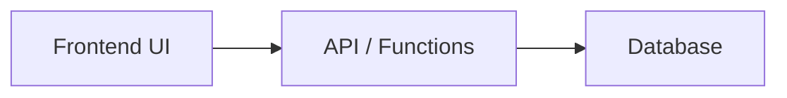

# Basic 3-Tier Structure

## Pattern

- UI -> API -> DB
- Direct communication from the frontend (UI) to the API, which interacts with the database.
- Suitable for simple CRUD operations and synchronous flows.

## Diagram

## Modules Using This Pattern

- questionV1
- profile
- coordinate

## Potential Change Notes

- Potential module naming mismatch: `questionV1` may be stale compared with current repository module naming conventions.
