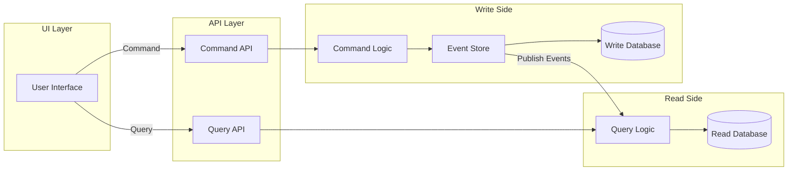

# CQRS (Command Query Responsibility Segregation)

CQRS is an architectural pattern that separates the handling of read (query) and write (command) operations into distinct models. This separation allows each side to be optimized independently, improving scalability, maintainability, and clarity in complex systems.

## How CQRS Works

- **Commands:** Represent requests to change the system's state. Commands are processed by the write model, which validates and applies changes, often generating events for event sourcing.
- **Queries:** Retrieve data without modifying state. The read model is tailored for efficient data access and can be scaled or shaped independently from the write model.

## Benefits

- **Scalability:** Read and write workloads can be scaled independently, supporting high-throughput scenarios.
- **Separation of Concerns:** Clear distinction between business logic for updates and data retrieval.
- **Optimized Data Models:** Read models can be denormalized for fast queries, while write models enforce business rules.
- **Auditability:** When combined with event sourcing, every command results in events that provide a complete history of changes.

## Implementation in the System

CQRS is implemented as follows:
`quest3Tier` - 
`quest5TierEG` - 
In modules like `quest5Tier`, CQRS is fully implemented:

- The UI sends commands and queries to separate endpoints.
- Commands are processed asynchronously, generating events and updating the write model.
- Queries access a read-optimized model for fast data retrieval.
- Azure Service Bus and Application Insights are used to manage event flows and trace operations, with correlation IDs ensuring end-to-end visibility.

This approach enables the system to handle complex business requirements, maintain robust audit trails, and scale efficiently as usage grows.

## CQRS Architecture Diagram

## Potential Change Notes

- Potential module mapping mismatch: `quest5Tier` is described here as fully CQRS, while the module mapping in Overview associates the full CQRS + event sourcing pattern with `quest5TierEG`.

## Wikipedia Reference

- Command Query Responsibility Segregation: https://en.wikipedia.org/wiki/Command_Query_Responsibility_Segregation
