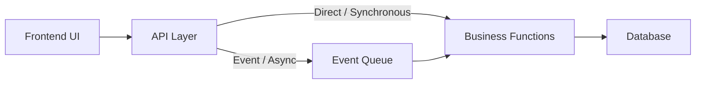

# Event-Driven Architecture

Modules that require asynchronous processing or decoupling utilize event queues, enabling scalable background operations and improved system responsiveness.

## Pattern

- UI -> API -> Some Event Queue -> Business Functions -> DB
- API layer pushes certain operations to an event queue, and in other cases call the business logic directly.
- Business logic is decoupled and may process events asynchronously.
- Database updates are triggered by business functions after event processing.
- Useful for scenarios needing background processing or decoupling.

## Diagram

## Modules Using This Pattern

- questionV2

## Potential Change Notes

- Potential module naming mismatch: `questionV2` may be stale compared with current repository module naming conventions.

## Wikipedia Reference

- Event-driven architecture: https://en.wikipedia.org/wiki/Event-driven_architecture
