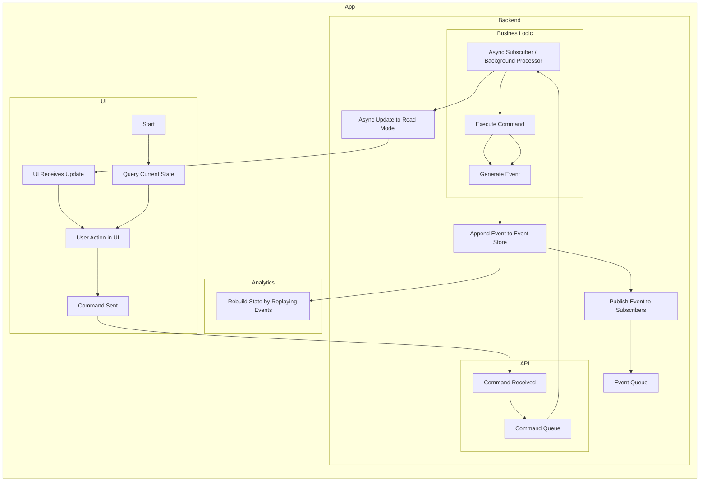

# Event sourcing

Event sourcing is an architectural pattern where state changes are captured as a sequence of immutable events, rather than directly updating data models. Each event represents a meaningful change in the system, such as a user action or a business process outcome.

## How It Works

- **Event Generation:** When a command is processed, the system generates one or more events describing the change.
- **Event Storage:** Events are persisted in an append-only event store, providing a complete history of all changes.
- **State Reconstruction:** The current state of an entity is rebuilt by replaying its events in order.
- **Auditability:** Every change is recorded, enabling full traceability and the ability to reconstruct past states for debugging or compliance.

## Benefits

- **Audit Trail:** All changes are logged, supporting compliance and troubleshooting.
- **Replayability:** Events can be replayed to restore state or migrate data.
- **Scalability:** Decouples write and read models, supporting high-throughput scenarios.
- **Flexibility:** Enables advanced features like temporal queries and event-driven integrations.

## Implementation in the System

In modules such as `quest5Tier`, event sourcing is used for command processing. Commands result in events that are stored and later consumed by business logic and downstream systems. Azure Service Bus is leveraged for event distribution, and Azure Application Insights tracks event flows using correlation IDs.

This approach ensures that every business action is traceable, recoverable, and extensible, forming a robust foundation for complex, scalable applications.

## Event Sourcing Flow Diagram

## Potential Change Notes

- Potential module mapping mismatch: this content names `quest5Tier` for event sourcing, while module mapping in Overview suggests the full CQRS + event sourcing variant under `quest5TierEG`.
- Typo preserved from source diagram label: `Busines Logic` likely intended as `Business Logic`.
