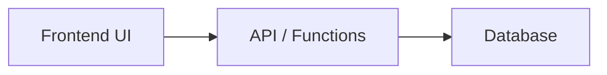
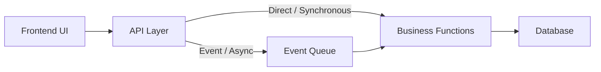
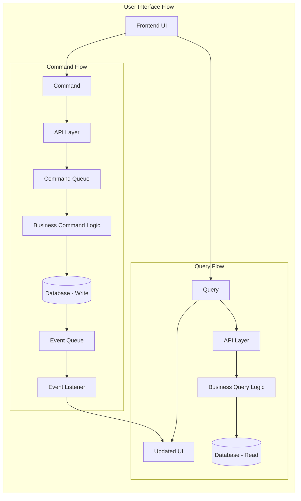
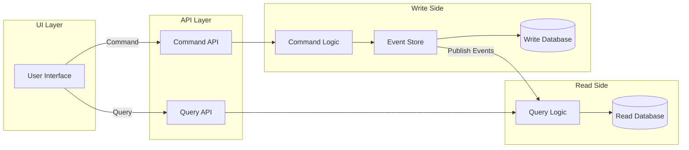
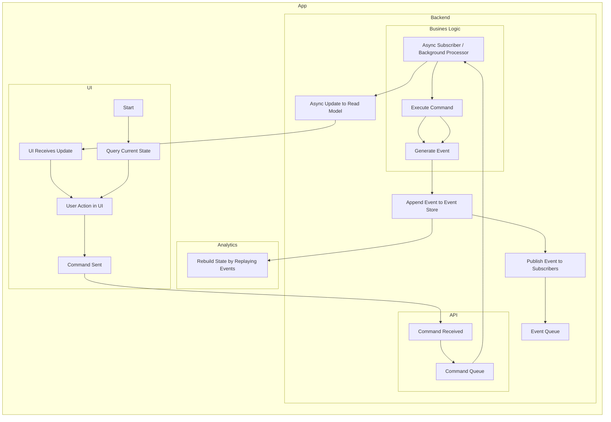

# System Architecture Overview

This document provides a high-level overview of the system architecture, describing the main architectural patterns and how each module fits into the overall design.

# Summary

The system is designed with modularity and scalability in mind. Each module is implemented with an architecture best suited to its domain requirements, ranging from simple 3-tier CRUD flows to advanced event-driven and CQRS patterns. This approach enables the system to evolve and scale as new features and complexity are introduced.

# Multi Functional Platform

The platform is usable as a template for any business functionality that can be built on the presented architectural patterns.
The modules provide example business functionality based on specific patterns to showcase the patterns and guide developers when implementing new business functionality.

# Overarching Architectural Features

The system leverages several overarching architectural patterns to ensure flexibility, maintainability, and scalability:

- **Modular Design:** Each module is developed as an independent component with its own UI, API, business logic, deployment code, and database. This allows for isolated development, testing, and deployment.
- **Separation of Concerns:** Responsibilities are clearly divided between presentation, business logic, and data layers, reducing coupling and improving code clarity.
- **Modern frontend stack:** React + Vite for fast development and performance.
- **Infrastructure as code:** Terraform and PowerShell scripts automate deployment.
- **Event-Driven Architecture:** Modules that require asynchronous processing or decoupling utilize event queues, enabling scalable background operations and improved system responsiveness.
- **CQRS and Event Sourcing:** For complex domains, the system adopts Command Query Responsibility Segregation (CQRS) and event sourcing, supporting auditability, replayability, and high scalability.
- **Scalability and Extensibility:** The architecture is designed to support future growth, allowing new modules and patterns to be integrated as requirements evolve.
- **Shared utilities:** Common code is reused via the shared module.

These patterns collectively provide a robust foundation for building, evolving, and maintaining the platform.

# Code Folder Structure

# Modular Architecture Patterns

The system is composed of several modules, each implementing a distinct architectural pattern based on its requirements and complexity. The three main patterns are:

## 1. Basic 3-Tier Structure

### Pattern

- UI → API → DB
- Direct communication from the frontend (UI) to the API, which interacts with the database.
- Suitable for simple CRUD operations and synchronous flows.

#### Diagram

### Modules using this pattern

- `questionV1`
- `profile`
- `coordinate`

---

## 2. Partial 5-Tier Async

### Pattern

- UI → API → Some Event Queue → Business Functions → DB
- API layer pushes certain operations to an event queue, and in other cases call the business logic directly.
- Business logic is decoupled and may process events asynchronously.
- Database updates are triggered by business functions after event processing.
- Useful for scenarios needing background processing or decoupling.

### Diagram

### Modules using this pattern

- `questionV2`

---

## 3. CQRS 5-Tier with Full Event Sourcing for Commands

### Pattern:

- **Queries:** UI → Query → API → Business Query Logic → DB (Read only)
- **Commands:** UI → Command → API → Command Queue → Business Command Logic → DB → Event Queue

- Implements Command Query Responsibility Segregation (CQRS).
- Event sourcing is used for commands, ensuring auditability and replayability.
- Read and write paths are fully separated, supporting scalability and complex business rules.
- Correlation IDs: Enable traceability of transactsion from user action to final result.

### Diagram

### Modules using this pattern:

- `questionV3`

---

## Module Architecture Mapping

| Module     | Architecture Pattern             | Notes                                 |
| ---------- | -------------------------------- | ------------------------------------- |
| questionV1 | Basic 3-Tier                     | Simple CRUD, direct API-DB            |
| profile    | Basic 3-Tier                     | User profile management               |
| coordinate | Basic 3-Tier                     | Location/coordinate logic             |
| questionV2 | Incomplete 5-Tier w/ Event Queue | Event-driven, async business logic    |
| questionV3 | 5-Tier CQRS + Event Sourcing     | Full separation, event sourcing, CQRS |

---

# Correlation IDs

Correlation IDs are unique identifiers attached to each transaction or request as it flows through the system. Their primary purpose is to enable end-to-end traceability, allowing developers and operators to follow a transaction from its origin (such as a user action in the UI) through APIs, event queues, business logic, and database operations.

Correlation IDs are generated at the UI layer with every user action and then propagated across all downstream components, including messages sent via Azure Service Bus. This ensures that every event, command, and data update related to a transaction carries the same correlation ID.

Integration with Azure Application Insights further enhances visibility. By including correlation IDs in telemetry data, logs, and traces, the system enables comprehensive monitoring and auditing. Operators can easily search for a specific correlation ID in App Insights to view the complete lifecycle of a transaction, identify bottlenecks, diagnose failures, and verify that all steps were executed as expected.

This approach provides robust auditability, simplifies debugging, and supports compliance requirements by making it straightforward to reconstruct the history of any transaction across distributed system components.

# CQRS (Command Query Responsibility Segregation)

CQRS is an architectural pattern that separates the handling of read (query) and write (command) operations into distinct models. This separation allows each side to be optimized independently, improving scalability, maintainability, and clarity in complex systems.

## How CQRS Works

- **Commands:** Represent requests to change the system's state. Commands are processed by the write model, which validates and applies changes, often generating events for event sourcing.
- **Queries:** Retrieve data without modifying state. The read model is tailored for efficient data access and can be scaled or shaped independently from the write model.

## Benefits

- **Scalability:** Read and write workloads can be scaled independently, supporting high-throughput scenarios.
- **Separation of Concerns:** Clear distinction between business logic for updates and data retrieval.
- **Optimized Data Models:** Read models can be denormalized for fast queries, while write models enforce business rules.
- **Auditability:** When combined with event sourcing, every command results in events that provide a complete history of changes.

## Implementation in the System

In modules like `questionV3`, CQRS is fully implemented:

- The UI sends commands and queries to separate endpoints.
- Commands are processed asynchronously, generating events and updating the write model.
- Queries access a read-optimized model for fast data retrieval.
- Azure Service Bus and Application Insights are used to manage event flows and trace operations, with correlation IDs ensuring end-to-end visibility.

This approach enables the system to handle complex business requirements, maintain robust audit trails, and scale efficiently as usage grows.

## CQRS Architecture Diagram

# Event sourcing

Event sourcing is an architectural pattern where state changes are captured as a sequence of immutable events, rather than directly updating data models. Each event represents a meaningful change in the system, such as a user action or a business process outcome.

### How It Works

- **Event Generation:** When a command is processed, the system generates one or more events describing the change.
- **Event Storage:** Events are persisted in an append-only event store, providing a complete history of all changes.
- **State Reconstruction:** The current state of an entity is rebuilt by replaying its events in order.
- **Auditability:** Every change is recorded, enabling full traceability and the ability to reconstruct past states for debugging or compliance.

### Benefits

- **Audit Trail:** All changes are logged, supporting compliance and troubleshooting.
- **Replayability:** Events can be replayed to restore state or migrate data.
- **Scalability:** Decouples write and read models, supporting high-throughput scenarios.
- **Flexibility:** Enables advanced features like temporal queries and event-driven integrations.

### Implementation in the System

In modules such as `questionV3`, event sourcing is used for command processing. Commands result in events that are stored and later consumed by business logic and downstream systems. Azure Service Bus is leveraged for event distribution, and Azure Application Insights tracks event flows using correlation IDs.

This approach ensures that every business action is traceable, recoverable, and extensible, forming a robust foundation for complex, scalable applications.

## Event Sourcing Flow Diagram

## CI/CD, Deployment Automation

The system uses deployment scripts in conjunction with infrastructure as code to enable consistent deployment of the infrastructure as well as the application components

## Automation Layers

The deployment scripts are structured in layers to take best advantage of relevant scripting languages and enable flexibility for use in CI/CD pipelines, manual deployments, as well as local developer environments.

1. **Orchestration:**  
   This stage uses PowerShell to coordinate the deployment steps.
2. **Preparation:**  
   This stage uses JavaScript to prepare the environment and perform any complex calculations required for the next stage.
3. **Application:**  
   This stage uses Terraform or other required infrastructure as code library to deploy to the relevant backend environment.

## Prerequisites

For the deployment scripts to work, certain prerequisites of the environment must be met.

Azure subscription
EntraID user

The infrastructure deployment is automated using PowerShell (`deployfullstack.ps1`) and Terraform scripts. The sequence follows these steps:

1. **Environment Preparation**

   - The PowerShell script initializes environment variables and configuration settings required for deployment (e.g., subscription, resource group, region).

2. **Terraform Initialization**

   - The script runs `terraform init` to set up the Terraform working directory and download required providers.

3. **Terraform Plan**

   - Executes `terraform plan` to preview infrastructure changes and validate the configuration.

4. **Terraform Apply**

   - Runs `terraform apply` to provision Azure resources, including:
     - Resource Group
     - Storage Account
     - Azure Service Bus
     - Application Insights
     - Cosmos DB or SQL Database (as required by modules)
     - Azure Functions and Static Web Apps

5. **Deployment of Application Code**

   - After infrastructure is provisioned, the script deploys application code:
     - Frontend (React/Vite) is built and deployed to Azure Static Web Apps.
     - Backend APIs and Azure Functions are published to their respective Azure resources.

6. **Configuration and Secrets**

   - The script configures connection strings, secrets, and environment variables for each module, ensuring secure integration between services.

7. **Verification and Output**
   - Outputs resource endpoints and connection details.
   - Verifies successful deployment by checking resource health/status.

This sequence ensures consistent, repeatable, and secure deployment of the full stack application and its supporting infrastructure.
