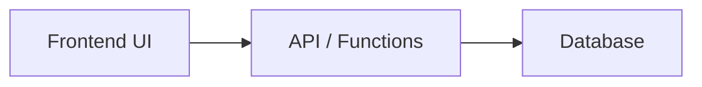
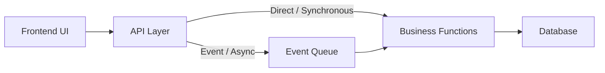

# System Architecture Overview

This document provides a high-level overview of the system architecture, describing the main architectural patterns and how each module fits into the overall design.

# Summary

The system is designed with modularity and scalability in mind. Each module is implemented with an architecture best suited to its domain requirements, ranging from simple 3-tier CRUD flows to advanced event-driven and CQRS patterns. This approach enables the system to evolve and scale as new features and complexity are introduced.

# Multi Functional Platform

The platform is usable as a template for any business functionality that can be built on the presented architectural patterns.
The modules provide example business functionality based on specific patterns to showcase the patterns and guide developers when implementing new business functionality.

# Overarching Architectural Features

The system leverages several overarching architectural patterns to ensure flexibility, maintainability, and scalability:

- **Modular Design:** Each module is developed as an independent component with its own UI, API, business logic, deployment code, and database. This allows for isolated development, testing, and deployment.
- **Separation of Concerns:** Responsibilities are clearly divided between presentation, business logic, and data layers, reducing coupling and improving code clarity.
- **Modern frontend stack:** React + Vite for fast development and performance.
- **Infrastructure as code:** Terraform and PowerShell scripts automate deployment.
- **Event-Driven Architecture:** Modules that require asynchronous processing or decoupling utilize event queues, enabling scalable background operations and improved system responsiveness.
- **CQRS and Event Sourcing:** For complex domains, the system adopts Command Query Responsibility Segregation (CQRS) and event sourcing, supporting auditability, replayability, and high scalability.
- **Scalability and Extensibility:** The architecture is designed to support future growth, allowing new modules and patterns to be integrated as requirements evolve.
- **Shared utilities:** Common code is reused via the shared module.

These patterns collectively provide a robust foundation for building, evolving, and maintaining the platform.

# Code Folder Structure

# Modular Architecture Patterns

The system is composed of several modules, each implementing a distinct architectural pattern based on its requirements and complexity. The three main patterns are:

## 1. Basic 3-Tier Structure

### Pattern

- UI → API → DB
- Direct communication from the frontend (UI) to the API, which interacts with the database.
- Suitable for simple CRUD operations and synchronous flows.

#### Diagram

### Modules using this pattern

- `questionV1`
- `profile`
- `coordinate`

---

## 2. Partial 5-Tier Async

### Pattern

- UI → API → Some Event Queue → Business Functions → DB
- API layer pushes certain operations to an event queue, and in other cases call the business logic directly.
- Business logic is decoupled and may process events asynchronously.
- Database updates are triggered by business functions after event processing.
- Useful for scenarios needing background processing or decoupling.

### Diagram

### Modules using this pattern

- `questionV2`

---

## 3. CQRS 5-Tier with Full Event Sourcing for Commands

### Pattern:

- **Queries:** UI → API → Business Query Logic → DB Read Replica
- **Commands:** UI → API → Command Queue → Business Command Logic → DB → Event Queue

- Implements Command Query Responsibility Segregation (CQRS).
- Event sourcing is used for commands, ensuring auditability and replayability.
- Read and write paths are fully separated, supporting scalability and complex business rules.
- Correlation IDs: Enable traceability of transactsion from user action to final result.

### Diagram

### Modules using this pattern:

- `questionV3`

---

## Module Architecture Mapping

| Module     | Architecture Pattern             | Notes                                 |
| ---------- | -------------------------------- | ------------------------------------- |
| questionV1 | Basic 3-Tier                     | Simple CRUD, direct API-DB            |
| profile    | Basic 3-Tier                     | User profile management               |
| coordinate | Basic 3-Tier                     | Location/coordinate logic             |
| questionV2 | Incomplete 5-Tier w/ Event Queue | Event-driven, async business logic    |
| questionV3 | 5-Tier CQRS + Event Sourcing     | Full separation, event sourcing, CQRS |

---

# Correlation IDs

Correlation IDs are unique identifiers attached to each transaction or request as it flows through the system. Their primary purpose is to enable end-to-end traceability, allowing developers and operators to follow a transaction from its origin (such as a user action in the UI) through APIs, event queues, business logic, and database operations.

In ZenMeChatPOC1, correlation IDs are generated at the UI layer with every user action and then propagated across all downstream components, including messages sent via Azure Service Bus. This ensures that every event, command, and data update related to a transaction carries the same correlation ID.

Integration with Azure Application Insights further enhances visibility. By including correlation IDs in telemetry data, logs, and traces, the system enables comprehensive monitoring and auditing. Operators can easily search for a specific correlation ID in App Insights to view the complete lifecycle of a transaction, identify bottlenecks, diagnose failures, and verify that all steps were executed as expected.

This approach provides robust auditability, simplifies debugging, and supports compliance requirements by making it straightforward to reconstruct the history of any transaction across distributed system components.
