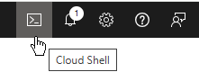
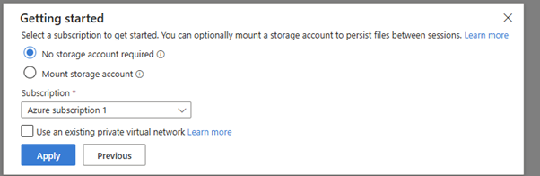

This document guides you through the setup from nothing (no accounts or sign-in and no money) to having the architecture of the system running

# Create a new azure subscription

Follow the guide to create a Microsoft org account

# Create AWS account

# Create central users & security

Follow these steps to run the corpSetUp script:

1.  go to this link: https://portal.azure.com/ (Sign in if you have not already done so)

     

1.  select the Cloud shell button at the top right of the header.

1.  at the bottom of the website a getting started page will appear

     

1.  select No storage account required

1.  for the subscription select "Azure subscription 1"

1.  then click the apply button

1.  wait 20 seconds for the terminal to fully boot up till you see your directory

1.  paste into the terminal the following:

        git clone https://github.com/ZenMe-AU/ZBCorpArchitecture.git

        node ./ZBCorpArchitecture/corpSetup/initCorpEnvDeploy.js

1.  after the .js has finished running the corpSetUp should be fully installed

# Run deployEnv

https://github.com/ZenMe-AU/ZBReactArchitecture
