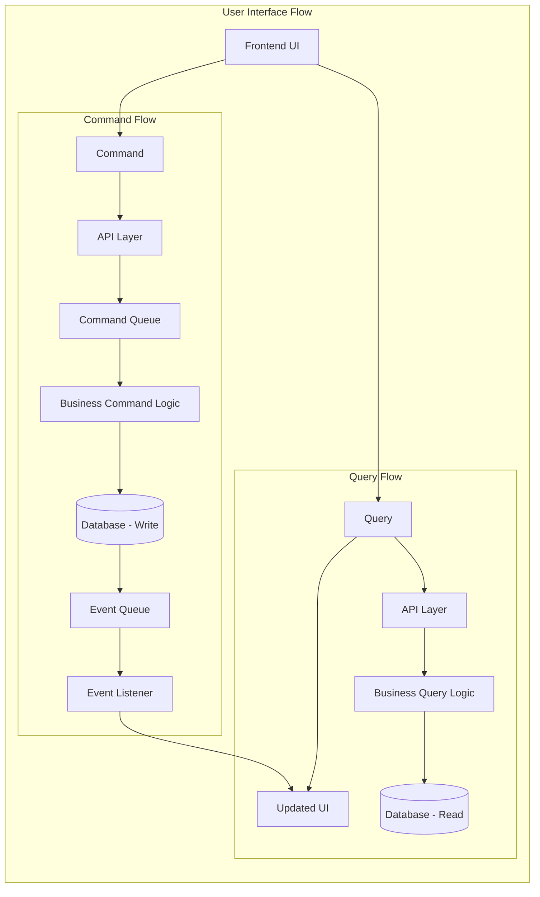

# Quest 5-Tier EventGrid

The quest5TierEg module is an example Question-and-Answer feature built to demonstrate a full 5-tier CQRS + event-driven pattern in this repo. It separates read APIs (queries like get questions/answers/events) from write APIs (commands like create/update/share/follow-up), where commands are processed asynchronously through Event Grid/queue handlers and emit domain events for traceability. On the UI side, it exposes routes for listing, viewing, answering, editing, sharing, and follow-up flows around questions.

## Pattern

- Queries: UI -> Query -> API -> Business Query Logic -> DB (Read only)
- Commands: UI -> Command -> API -> Command Queue -> Business Command Logic -> DB -> Event Queue

- Implements Command Query Responsibility Segregation (CQRS).
- Event sourcing is used for commands, ensuring auditability and replayability.
- Read and write paths are fully separated, supporting scalability and complex business rules.
- Correlation IDs: Enable traceability of transaction from user action to final result.

## Diagram

## Modules Using This Pattern

- quest5Tier

## Potential Change Notes

- Potential module mapping mismatch with the architecture mapping table in Overview, which indicates a CQRS + event sourcing variant under `quest5TierEG`.
